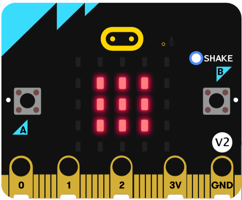
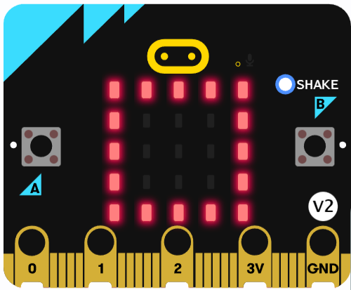
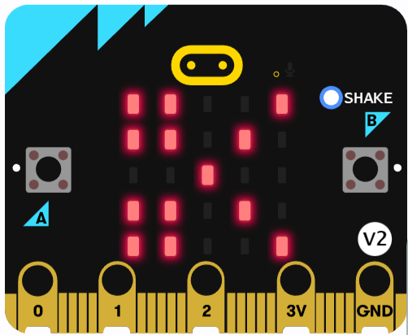

# Entrega-de-Atividade-Professor-Poyatos

1) Projeto Pedra, Papel e Tesoura.
- Entrega de atividade, feito no através do site https://makecode.microbit.org/#editor

 
 
 
 
Programação em bloco: 
 
 

